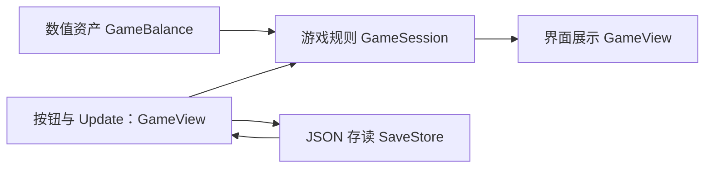

# Unity 自动 Boss 成长游戏：微型原型实现方案

版本：v0.2 · 日期：2026-09-07

本方案已在用户指定的 Unity 项目中实现。运行方式见根目录 README.md，数值与规则保持如下约定。

## 1. 目标与实施范围

完成一个单场景、鼠标操作的桌面原型：自动推关、玩家手选回刷目标、购买永久强化和新武器、保存进度。用 3 把武器、10 级强化、6 个 Boss 验证约 15 分钟的成长循环。

已确认的规则：

- 自动战斗，胜负由当前武器和永久强化产生的秒伤决定。
- 推关成功后自动挑战下一关；失败后停止，等待玩家重试或选择回刷。
- 回刷固定重复玩家选定的已通关 Boss；系统不推荐、排序或自动选择最优收益目标。
- 战中购买立即影响后续伤害，不重置当前 Boss 血量和挑战计时。
- 新武器按顺序购买，自动替换旧武器，永久强化保留。
- 无离线收益；恢复存档后由玩家点击继续。

实现默认值：

- 用户指定的工作目录及现有 Unity 项目根目录为 `C:\Users\root\Desktop\My ga`；后续本游戏的代码、场景、数据及文档都在此目录完成。
- 已读取目标项目的 `ProjectSettings/ProjectVersion.txt`：Unity `2022.3.52f1`，本机存在对应编辑器。项目已有 2D 功能包、uGUI 1.0.0、TMP 3.0.7、Test Framework 1.1.33；沿用这些配置。
- 单场景、uGUI、TextMeshPro、普通按钮和图片；先用占位图验证玩法。
- 游戏窗口失去焦点时继续在线运行；关闭进程、系统休眠或停止更新的时间不补算收益。Windows 后台运行使用 `Application.runInBackground`。[Unity 文档](https://docs.unity3d.com/2022.3/Documentation/ScriptReference/Application-runInBackground.html)

首版不加入物理碰撞战斗、角色移动、暴击、护甲、装备词条、转生、联网及云存档。这些系统不会帮助验证当前的金币与成长关系。

## 2. 固定数值配置

### 2.1 公共规则

| 配置 | 值 |
|---|---:|
| 初始金币 | 0 |
| 初始武器 | W1 |
| 初始永久强化等级 | 0 |
| 单场战斗时限 | 30 秒 |
| 击杀后结算刷新时间 | 1 秒 |
| 强化等级上限 | 10 |
| 每级强化增加的基础倍率 | 0.2 |

```text
实际秒伤 = 武器基础秒伤 × (1 + 0.2 × 强化等级)
首次击杀金币 = 重复击杀金币 + 首通额外金币
重复击杀金币 = 对应 Boss 的固定金币奖励
```

正好在第 30 秒击杀判定为胜利。1 秒结算刷新时间不占用下一场的 30 秒时限。

### 2.2 武器

| ID | 临时名称 | 基础秒伤 | 购买金币 |
|---|---|---:|---:|
| W1 | 铁剑 | 10 | 0 |
| W2 | 重剑 | 40 | 200 |
| W3 | 符文巨剑 | 160 | 800 |

价格为本次实际扣款，无旧武器折价。只能购买下一把；金币购买本身完成解锁，不额外增加 Boss 通关门槛。

### 2.3 永久强化

| 到达等级 | 本次升级金币 | 总倍率 |
|---:|---:|---:|
| 0 | 初始 | 1.0 |
| 1 | 20 | 1.2 |
| 2 | 35 | 1.4 |
| 3 | 60 | 1.6 |
| 4 | 100 | 1.8 |
| 5 | 170 | 2.0 |
| 6 | 280 | 2.2 |
| 7 | 450 | 2.4 |
| 8 | 720 | 2.6 |
| 9 | 1,150 | 2.8 |
| 10 | 1,840 | 3.0 |

`upgradeCosts[0]` 表示 0→1 级的价格，数组共 10 项；倍率按等级直接计算，不将每级倍率连续相乘。

### 2.4 Boss

| ID | 血量 | 重复击杀金币 | 首通额外金币 |
|---|---:|---:|---:|
| B1 | 150 | 10 | 10 |
| B2 | 400 | 24 | 60 |
| B3 | 1,200 | 55 | 150 |
| B4 | 3,600 | 145 | 350 |
| B5 | 8,000 | 305 | 700 |
| B6 | 14,000 | 520 | 1,200 |

显示 ID 从 1 开始；内部数组索引从 0 开始。B1 默认开放；首次击败 Bn 才开放 Bn+1。

## 3. 最小工程结构

复用现有 `Assets/Scenes/SampleScene.unity` 作为唯一游戏场景。该场景已保存原型 Canvas、按钮、字体及脚本引用，并在 Build Settings 中启用。

```text
My ga/
  Assets/Scenes/SampleScene.unity（现有场景）
  Assets/BossClicker/
    Data/PrototypeBalance.asset
    Art/PrototypeChinese.asset
    Editor/PrototypeSetup.cs
    Scripts/
      BossClicker.Runtime.asmdef
      GameBalance.cs
      GameSession.cs
      GameView.cs
      SaveStore.cs
    Tests/EditMode/
      BossClicker.Tests.asmdef
      GameSessionTests.cs
      SaveStoreTests.cs
  TestResults/
```

使用一个数值资产存全部配置，不给每把武器和每个 Boss 单独创建管理器或数据资产。`ScriptableObject` 适合保存编辑期配置；玩家运行时进度另存 JSON，不写回配置资产。[Unity 文档](https://docs.unity3d.com/2022.3/Documentation/Manual/class-ScriptableObject.html)

测试程序集引用运行程序集及 Unity Test Framework；运行程序集包含 uGUI、TMP 所需引用。使用 Unity 自带的 Test Runner，不添加第三方运行时框架。

## 4. 四个核心脚本及职责

| 脚本 | 类型 | 负责内容 |
|---|---|---|
| `GameBalance` | ScriptableObject | 武器数组、Boss 数组、升级价格、30 秒时限、1 秒刷新、强化系数；只读配置 |
| `GameSession` | 普通 C# 类 | 战斗推进、状态切换、购买校验、奖励、玩家成长；同文件声明简单的存档数据类和枚举 |
| `GameView` | MonoBehaviour | Inspector 引用、按钮绑定、调用 Session、刷新界面、转交保存请求 |
| `SaveStore` | 普通 C# 类 | JSON 读取、校验、写入和错误反馈；不推进游戏、不计算收益 |

`GameBalance` 中嵌套声明可序列化的武器和 Boss 记录。`GameView` 中声明可序列化的 Boss 行引用结构，固定配置 6 行，无需单独的列表框架。



不增加事件总线、单例管理器链、依赖注入或通用状态机库。界面直接调用 Session，Session 不访问 UI、文件或场景对象。

### 4.1 Session 的主要操作

| 操作 | 行为 |
|---|---|
| `StartProgress()` | 挑战最高通关索引 + 1；全部通关时显示阶段完成 |
| `SelectFarm(int bossIndex)` | 验证已通关，记住玩家选择并进入该 Boss 回刷 |
| `Retry()` | 仅失败后有效，用当前战力重新挑战失败目标 |
| `TryBuyUpgrade()` | 检查等级和余额，成功后统一扣款、加一级 |
| `TryBuyNextWeapon()` | 检查下一把武器和余额，成功后统一扣款、换武器 |
| `Tick(double seconds)` | 消费本次在线游戏时间，推进战斗与结算；报告是否发生存档内容变动 |

购买失败不改变任何数据。金币不足、最高武器、强化满级等状态也必须在 Session 中检查，不能只依赖按钮禁用。

命名使用 `PascalCase` 类名/方法名、`camelCase` 字段；数值含义写入名称，例如 `baseDps`、`firstClearBonus`。示例表达式为：

```csharp
public double CurrentDps =>
    balance.weapons[save.weaponIndex].baseDps *
    (1.0 + balance.upgradeStep * save.upgradeLevel);
```

## 5. 状态和战斗推进

战斗模式只有 `Progress` 和 `Farm`。阶段使用一个枚举：`Idle`、`Fighting`、`Intermission`、`Failed`、`Completed`。

| 当前阶段 | 条件或操作 | 结果 |
|---|---|---|
| Idle | 玩家开始推关或选择回刷 | 满血、计时归零，进入 Fighting |
| Fighting | Boss 在时限内死亡 | 发奖并记录，进入 1 秒 Intermission |
| Fighting | 达到 30 秒且未击杀 | 无奖励，进入 Failed |
| Fighting | 玩家切换目标或模式 | 当前未完成战斗放弃，无奖励；新战斗满血、计时归零 |
| Intermission | 玩家切换目标或模式 | 只更新下一场选择，继续等待当前剩余刷新时间 |
| Intermission | 计时结束，模式为 Progress | 挑战下一关；无下一关则 Completed |
| Intermission | 计时结束，模式为 Farm | 重复玩家选中的 Boss |
| Failed | 重试或选择回刷 | 按玩家操作开启新战斗 |
| Completed | 选择已通关 Boss | 允许继续回刷 |

### 5.1 计时算法

`GameView.Update()` 将 `Time.deltaTime` 交给 Session；血量和计时内部使用 `double`，显示血条时再转换为 UI 数值。`deltaTime` 是帧间隔且受 Unity 的最大步长限制；原型按实际提供的游戏步长推进，休眠和停止运行不补算。[Unity 文档](https://docs.unity3d.com/2022.3/Documentation/ScriptReference/Time-deltaTime.html)

每次 Tick 按最近的边界分段处理：

1. Fighting 阶段取“本次剩余步长、Boss 剩余血量 ÷ 当前秒伤、距离超时的秒数”三者最小值。
2. 只推进这段时间并扣除相应伤害。若击杀和超时同时发生，优先结算击杀；使用微小数值容差处理浮点误差。
3. 击杀后立即改变阶段，奖励入口仅在 Fighting→Intermission 时执行，防止下一帧重复发钱。
4. Tick 尚有剩余时间时继续消费 1 秒 Intermission；刷新结束后仍有余量，则继续推进下一场。
5. Failed、Idle、Completed 不继续消耗战斗时间。

这样可以避免低帧率改变击杀时间，也避免每次刷新丢失半帧时间。无需 FixedUpdate、物理碰撞或根据武器动画回调发伤害。

### 5.2 必须保留的边界

- 战中购买只改变后续 Tick 使用的秒伤，不重新计算过去的伤害。
- 点击当前正在回刷的同一目标视为不切换，避免无意重置该场。
- 击杀后的 1 秒刷新不能通过选关、切模式或重复点击开始来跳过。
- 已经结算的击杀收入不会因为切关而撤销；未完成的战斗没有部分金币。
- 购买再多升级，Farm 模式仍保持原目标；只有玩家选择才改变目标或回到推关。
- 历史击杀耗时使用本场累计时间记录；中途升级时不能事后用最终秒伤反推整场耗时。

## 6. 场景与 UI 连接

```text
SampleScene
  Main Camera
  EventSystem
  Canvas（Screen Space Overlay，Canvas Scaler）
    GameRoot（GameView）
      TopBar：金币、武器、强化等级、实际秒伤
      BattlePanel：Boss 名称、图片、血条、剩余时间、模式
      BossList：6 行关卡信息和回刷按钮
      ShopPanel：强化按钮、下一把武器按钮、价格与购买后秒伤
      ActionPanel：开始/继续推关、失败重试、阶段完成提示
      SaveStatus：保存失败提示与重试入口
```

以 1280×720 为参考布局，验证 16:9 窗口与较小窗口不会遮挡按钮。文本使用包含中文字符的 TMP 字体资产。按钮、Image、Slider 即可完成首版；动画只做受击反馈，不参与战斗结算。

UI 规则：

- Boss 列表保持 B1→B6 的顺序，不按收益排序、不标记最优。
- 每行显示血量、重复金币、首通奖励领取状态和“上次击杀耗时”；未击杀时显示未记录。
- 浏览信息不切关；只有点击明确的回刷/推关按钮才执行操作。
- 回刷按钮仅对已通关 Boss 开放；最新未通关 Boss 从推关入口挑战。
- 血条和倒计时每帧更新；金币、购买价格与关卡文字在数值发生变化时更新即可。
- 回刷结算用简短提示，不弹出必须点击关闭的结算窗口。
- 进入商店不暂停战斗；购买后立即更新实际秒伤与按钮状态。

## 7. 运行数据与存档

### 7.1 持久化字段

| 字段 | 类型 | 初始值 / 含义 |
|---|---|---|
| `schemaVersion` | int | 1 |
| `coins` | long | 0，保持整数金币 |
| `weaponIndex` | int | 0，即 W1 |
| `upgradeLevel` | int | 0 |
| `highestClearedBossIndex` | int | -1，尚未通关任何 Boss |
| `lastFarmBossIndex` | int | -1，玩家尚未选择回刷 |
| `lastClearSeconds` | double[6] | 0 表示未记录 |

由于关卡只能顺序通关，最高通关索引已经能表示首通奖励领取状态：只有击败索引大于旧最高通关索引的 Boss 才发额外奖励。将金币、最高通关索引和历史耗时一并更新，再保存一次，避免维护两套重复的首通标记。

当前 Boss 血量、当前计时、结算剩余时间、战斗模式和阶段只保留在内存。读档后进入 Idle；保留玩家曾选的回刷目标，但不自动开战。不保存离线时间戳，不根据关闭时间增加金币。

### 7.2 保存方式

- 用 `JsonUtility` 序列化普通可序列化字段。[Unity 文档](https://docs.unity3d.com/2022.3/Documentation/ScriptReference/JsonUtility.html)
- 保存到 `Application.persistentDataPath` 下本游戏专用的 `boss-clicker-save-v1.json`。[Unity 文档](https://docs.unity3d.com/2022.3/Documentation/ScriptReference/Application-persistentDataPath.html)
- 每次发奖、成功购买、玩家选择回刷目标后保存；退出/暂停时再尝试保存一次，不每帧写文件。
- 先写同目录临时文件，再替换正式文件并保留上一份备份；首次保存使用新文件落盘。
- 文件不存在才初始化新档。解析失败或字段越界时尝试备份；均不可用则保留原文件并提示，不静默覆盖为新档。
- 检查金币非负、武器/强化/关卡索引范围、历史记录数组长度，且回刷目标必须已通关。
- 保存失败时保留内存进度并显示未保存状态；下次数据变动、用户重试或退出时再次尝试，避免每帧重复写入失败。
- 测试使用临时目录中的独立存档，不读写玩家正常存档。

## 8. 按可玩闭环实施

详细验收与文件范围见 [实施清单](todo.md)。

| 顺序 | 交付结果 | 依赖 |
|---|---|---|
| T1 | 初始武器自动击杀 B1、金币到账，场景能实际运行 | 无 |
| T2 | 能用金币强化和换武器，战斗中看到输出变化 | T1 |
| T3 | 推关、失败、手选回刷、固定刷新和末关完成全部串通 | T2 |
| T4 | 关闭重开保留成长，首通不会重复领取 | T3 |
| T5 | 录入完整数据，验证参考路线并完成桌面试玩 | T4 |

检查点设在 T2、T4、T5 结束后。共享的 Session 和场景修改按顺序进行；待接口稳定后，存档读写与数值核对可并行准备，合入前统一检查。

## 9. 验证方法与命令

已完成运行脚本、可编辑场景和 Windows 构建；15 项 EditMode 检查通过。验收记录见 todo.md。

### 9.1 必要自动检查

使用 Unity Test Framework 的 EditMode 测试，直接构造 Session 并调用 Tick；无需真实等待 15 分钟。

- B1：15 秒击杀，首通总计 20 金币；回刷只得 10 金币。
- W1→W2 时 L2 保留，秒伤 14→56；余额不足与满级购买不扣金币。
- 30 秒整击杀判胜，略超时判负；大步长与多个小步长结果一致。
- 同一次击杀不重复发奖；完整 1 秒刷新保留，切关不能跳过。
- 购买不重置已消耗的挑战时间；回刷目标不因升级而改变。
- 保存往返恢复数值；重复启动无额外金币、无重复首通；坏存档不覆盖原数据。

一次性低成本 UI 摆放无需逐元素测试；在 Unity Game 视图和 Windows 构建中人工检查按钮及文字。

### 9.2 本机启动与测试命令

已确认可用编辑器及用户指定项目路径如下。运行批处理前关闭同一原型项目的交互编辑器实例。

```powershell
$unityExe = 'C:\Program Files\Unity\Hub\Editor\2022.3.52f1\Editor\Unity.exe'
$prototypeRoot = 'C:\Users\root\Desktop\My ga'
& $unityExe -projectPath $prototypeRoot
```

```powershell
$unityExe = 'C:\Program Files\Unity\Hub\Editor\2022.3.52f1\Editor\Unity.exe'
$prototypeRoot = 'C:\Users\root\Desktop\My ga'
$testOutput = Join-Path $prototypeRoot 'TestResults'
New-Item -ItemType Directory -Path $testOutput -Force | Out-Null
& $unityExe -batchmode -projectPath $prototypeRoot -runTests -testPlatform EditMode -testResults (Join-Path $testOutput 'editmode.xml') -logFile (Join-Path $testOutput 'editmode.log')
```

命令参数依据 Unity Test Framework 1.1 文档。检查 XML 的实际执行数和失败数，零测试不能当成通过。[官方命令说明](https://docs.unity3d.com/Packages/com.unity.test-framework@1.1/manual/reference-command-line.html)

桌面构建先用编辑器 `File > Build Settings`：保留现有 SampleScene 场景，选择 Windows x86_64，Build And Run。另可使用 `Boss Clicker > Build Windows Prototype`；该入口与场景装配方法共用一个编辑器脚本，输出 `Builds/Windows/BossForge.exe`。验证无编译错误、鼠标按钮可用、关闭重开后进度一致。

### 9.3 数值参考路线

此前已用连续秒伤模型计算下列路线，含 4 次各 30 秒失败，购买在击杀后执行，操作时间按零计。它是核对实现的参考路线，不作为游戏自动选关逻辑。

```text
首通 B1 → L1 → 挑战 B2 失败
回刷 B1 4 次 → L2 → 首通 B2 → 挑战 B3 失败
回刷 B1 12 次 → 买 W2 → 首通 B3 → L3、L4 → 挑战 B4 失败
回刷 B2 32 次 → 买 W3 → 首通 B4 → L5、L6
首通 B5 → L7 → 挑战 B6 失败
回刷 B4 1 次 → L8
回刷 B5 4 次 → L9
回刷 B5 6 次 → L10 → 首通 B6
```

| 参考节点 | 累计游戏时间 | 实际秒伤 |
|---|---:|---:|
| 首通 B1 后买 L1 | 16 秒 | 12 |
| L2 | 100 秒 | 14 |
| 购买 W2 | 300.14 秒 | 56 |
| 首通 B3 后 L4 | 322.57 秒 | 72 |
| 购买 W3 | 562.35 秒 | 288 |
| 完成 B6 的结算刷新 | 864.18 秒 | 480 |

金币在死亡时发放；表中节点计入击杀后的 1 秒刷新，实测对齐时需使用同一口径。L9 下 B6 需 31.25 秒，L10 下需约 29.17 秒；允许动画展示不同，但不能改动伤害结算时间。

刷钱效率按 `60 × 重复金币 ÷ (血量/秒伤 + 1)` 核对：DPS=14 时 B1/B2 分别约 51.2/48.7 金币每分钟；DPS=56 时 B1/B2/B3 分别约 163.1/176.8/147.1。玩家界面只提供既定的奖励与历史耗时信息。

## 10. 完成标准与后续调整

交付原型时应达到：

- [x] 用鼠标完成推关、回刷、强化和换武器的整个循环。
- [x] 完整录入本文件的数值；4 倍换武器收益与 30 秒门槛符合计算。
- [x] 玩家选定的回刷目标不会被系统擅自更换。
- [x] 断开游戏期间无收益，正常重启不丢失已成功保存的成长。
- [x] 必要 EditMode 检查通过，并完成一次真实的桌面试玩。

优先观察攒 W3 时约 3.5 分钟没有购买的空档，以及玩家是否能发现 B2 比 B3 更适合回刷。后期 B4/B5 收益接近，先记录试玩表现，再决定是否拉开。约 14 分 24 秒是模型参考，不等于已经验证的玩家实际通关时间。

实施时始终保留单场景、单配置入口和玩家手选关卡。后续若要接入既有 VR 项目、改变武器成长规则或增加离线收益，应先更新本方案中的相应约束；不把这些扩展预先写进原型。
